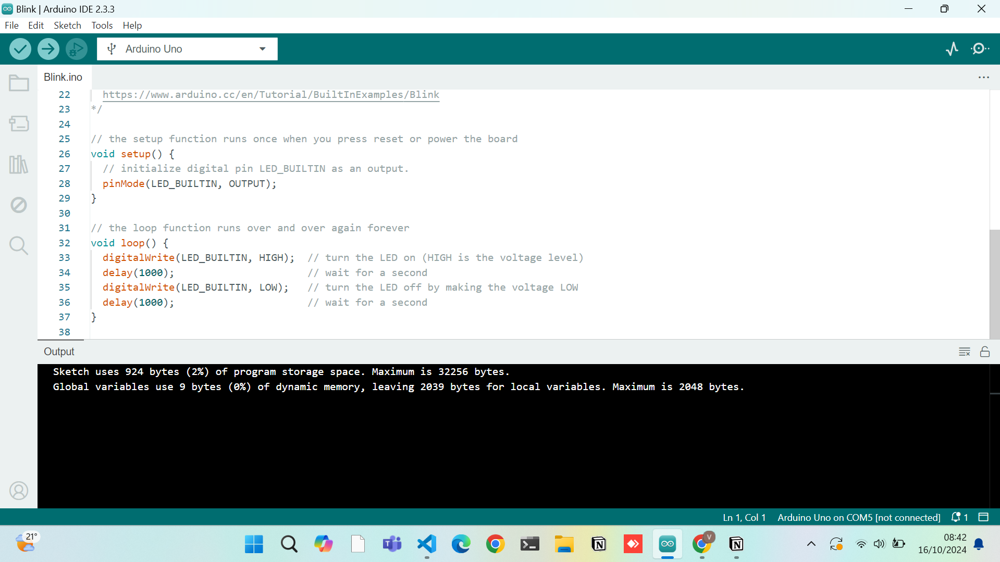
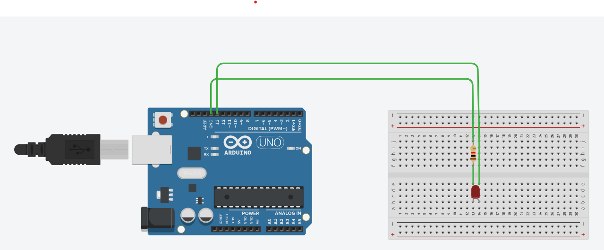

## Ponderada semana 1 

### Código completo do IDE
` /*
  Blink

  Turns an LED on for one second, then off for one second, repeatedly.

  Most Arduinos have an on-board LED you can control. On the UNO, MEGA and ZERO
  it is attached to digital pin 13, on MKR1000 on pin 6. LED_BUILTIN is set to
  the correct LED pin independent of which board is used.
  If you want to know what pin the on-board LED is connected to on your Arduino
  model, check the Technical Specs of your board at:
  https://www.arduino.cc/en/Main/Products

  modified 8 May 2014
  by Scott Fitzgerald
  modified 2 Sep 2016
  by Arturo Guadalupi
  modified 8 Sep 2016
  by Colby Newman

  This example code is in the public domain.

  https://www.arduino.cc/en/Tutorial/BuiltInExamples/Blink
*/

// the setup function runs once when you press reset or power the board
void setup() {
  // initialize digital pin LED_BUILTIN as an output.
  pinMode(LED_BUILTIN, OUTPUT);
}

// the loop function runs over and over again forever
void loop() {
  digitalWrite(LED_BUILTIN, HIGH);  // turn the LED on (HIGH is the voltage level)
  delay(1000);                      // wait for a second
  digitalWrite(LED_BUILTIN, LOW);   // turn the LED off by making the voltage LOW
  delay(1000);                      // wait for a second
}
 `

Imagem do código
 

 
Fonte: Material produzido por Vinícius(2024)

Vídeo do funcionamento
 
<video width="640" height="360" controls>
    <source src="video.mp4" type="video/mp4">
</video>
 
Fonte: Material produzido por Vinícius(2024)

&nbsp;&nbsp;&nbsp;&nbsp;&nbsp;&nbsp;Na simulação apresentada, foi criado um circuito básico no Tinkercad para fazer um LED piscar utilizando uma placa Arduino Uno. O circuito é composto por um LED conectado a um resistor, que limita a corrente, e está ligado ao pino digital 13 do Arduino, além da conexão ao GND. Com esse setup, é possível programar o Arduino para ligar e desligar o LED em intervalos regulares, criando o efeito de piscar. Essa simulação é um exemplo clássico de introdução ao Arduino, permitindo o entendimento dos conceitos básicos de controle de componentes eletrônicos através de programação.

Imagem do tinkercad
 

 
Fonte: Material produzido por Vinícius(2024)

